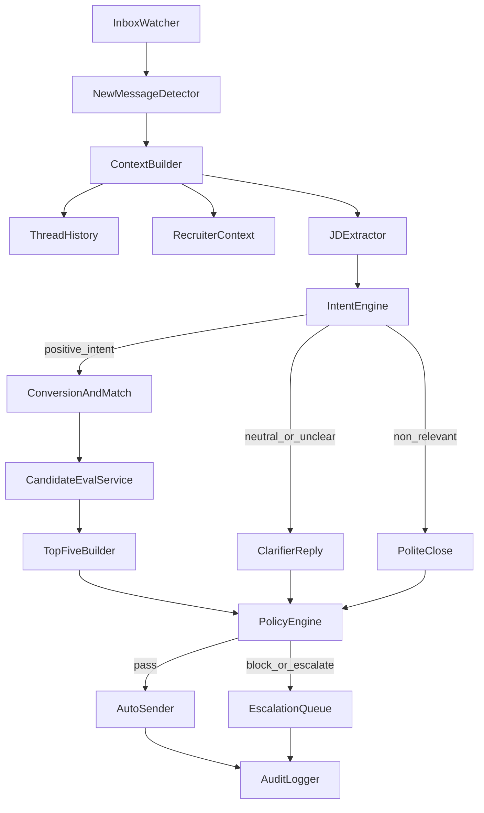

# Product Requirements Document (PRD)

## Product Name
LinkedIn Recruiter Conversion Assistant

## Document Status
Draft v1

## Date
2026-04-20

## 1) Problem Statement
Recruiters actively post jobs and initiate hiring conversations on LinkedIn, but many of these opportunities do not convert into hosted jobs on our platform. Manual follow-up is slow and inconsistent, and valuable recruiter intent signals are often missed.

We need an assistant that monitors inbound recruiter conversations on LinkedIn, identifies positive hiring intent, and guides recruiters to host jobs on our platform. When intent is positive and job context is sufficient, the assistant should immediately demonstrate value by presenting top 5 matched candidates using our existing JD-vs-candidate evaluation service.

## 2) Business Objective
- Increase the number of recruiters who host jobs on our platform.
- Reduce time-to-first-value by showing high-quality matched candidates during the conversation.
- Improve recruiter engagement and trust through context-aware, professional replies.

## 3) Goals and Non-Goals
### Goals (MVP)
- Detect new inbound recruiter messages in the currently logged-in LinkedIn account.
- Classify recruiter intent (positive, neutral/unclear, non-relevant).
- Send appropriate response automatically with strict guardrails.
- For positive intent, extract or request JD context and show top 5 matched candidates.
- Include platform-hosting CTA in positive-intent flow.
- Log conversation decisions and outcomes for measurement.

### Non-Goals (MVP)
- Multi-platform messaging support (email, WhatsApp, etc.).
- Full ATS workflow replacement.
- Automated contract/legal negotiation.
- Deep recruiter CRM features beyond basic context tracking.

## 4) Target Users
- **Primary:** Recruiters who message regarding open hiring needs.
- **Secondary:** Platform operations/business team monitoring conversion and quality.
- **Operator Persona:** Account owner using the logged-in LinkedIn profile as outreach endpoint.

## 5) User Stories
- As a platform operator, I want inbound recruiter messages detected quickly so no high-intent lead is missed.
- As the system, I want to classify hiring intent so I can choose the right response strategy.
- As a recruiter with active hiring needs, I want to see relevant candidates quickly so I can evaluate platform quality.
- As a business team member, I want measurable conversion and engagement metrics so I can improve messaging strategy.

## 6) End-to-End Workflow

## 7) Functional Requirements
### FR1: Inbox Monitoring and New Message Detection
- Monitor LinkedIn inbox for inbound messages in active recruiter threads.
- Detect only net-new inbound messages to avoid duplicate processing.
- Maintain message/thread ID-based idempotency.

**Acceptance Criteria**
- New inbound recruiter message is detected within target SLA.
- Duplicate reply is never sent for same inbound message ID.
- Non-new events (history refresh/reload) do not trigger reply.

### FR2: Context Builder
- Build context package per inbound event:
  - Recent conversation history (sent/received).
  - Recruiter metadata (name, company, role when available).
  - Extracted job context from current and prior messages.
- Apply recency weighting and key fact extraction.

**Acceptance Criteria**
- Context payload includes minimum required fields before response generation.
- Missing critical JD data is flagged for clarifying question flow.

### FR3: Intent Detection
- Classify inbound message as:
  - **Positive intent:** active hiring signal present.
  - **Neutral/unclear:** insufficient clarity about role/hiring timeline.
  - **Non-relevant:** no hiring action likely.
- Produce confidence score with thresholded branching.

**Acceptance Criteria**
- Each processed inbound message has one intent label and confidence score.
- Low-confidence predictions default to neutral/clarifying flow.

### FR4: Response Strategy Engine
- Choose response behavior by intent:
  - **Positive:** platform-hosting encouragement + candidate value demo.
  - **Neutral:** ask targeted clarifying questions for JD completion.
  - **Non-relevant:** polite close or no-op per policy.
- Ground all responses in known thread/JD facts.

**Acceptance Criteria**
- No response path violates configured policy constraints.
- Positive-intent replies include clear CTA for hosting on platform.

### FR5: Candidate Match Integration
- Use existing JD-vs-candidate evaluation service.
- Submit normalized JD payload.
- Retrieve ranked candidate list and format top 5 for recruiter-facing response.

**Acceptance Criteria**
- For eligible positive-intent threads, top 5 candidates are included in response.
- If service fails or JD is incomplete, fallback path asks for missing info or retries safely.

### FR6: Auto-Send with Guardrails
- Auto-send enabled for LinkedIn replies with strict policy checks:
  - factuality limits
  - data sharing rules
  - tone and brand voice
  - legal/risk-sensitive content blocking
- Escalate blocked messages to manual queue.

**Acceptance Criteria**
- Every outgoing response passes policy check or is escalated.
- No blocked response is sent.

### FR7: Audit Logging and Traceability
- Store for each event:
  - inbound message metadata
  - extracted context/JD summary
  - intent and confidence
  - candidate IDs shown
  - policy check result
  - final send status

**Acceptance Criteria**
- Complete trace available for every processed message thread event.
- Logs support business analytics and incident review.

## 8) Non-Functional Requirements
### Reliability
- High availability of message processing loop.
- Safe retry with no duplicate sends.

### Performance
- Near-real-time response latency target for detection + generation + send.
- Candidate retrieval should not degrade experience beyond defined threshold.

### Security and Privacy
- Encrypt sensitive stored data in transit and at rest.
- Retain minimum required recruiter/candidate PII.
- Enforce role-based access for logs and analytics.

### Observability
- Dashboard-ready metrics for pipeline health and business impact.
- Alerts for detection failures, send failures, and policy escalation spikes.

## 9) Guardrails and Safety Policy
- Do not fabricate candidate skills, compensation, notice period, or availability.
- Share only approved candidate fields in recruiter-visible responses.
- If JD context is incomplete, ask clarifying questions before ranking/showcase.
- Block or escalate legal/compliance-sensitive asks.
- Keep replies concise, professional, and recruiter-centric.

## 10) KPIs and Success Metrics
### Funnel Metrics
- Inbound recruiter messages detected.
- % messages classified as positive intent.
- % positive-intent threads with hosting CTA delivered.
- Recruiter conversion rate to “host job on platform.”

### Value Demonstration Metrics
- % positive-intent threads where top 5 candidates are shown.
- Recruiter engagement on showcased candidates (click/reply/follow-up interest).
- Time-to-first-candidate-showcase after first positive-intent signal.

### Quality and Safety Metrics
- Intent classification precision/recall (focus on positive intent).
- Auto-send success rate.
- Policy-block/escalation rate.
- Safety violation rate (target near zero).

## 11) Risks and Mitigations
- **Risk:** Wrong intent classification causes poor messaging.
  - **Mitigation:** confidence thresholds, neutral fallback, periodic quality review.
- **Risk:** Incomplete JD leads to poor candidate matches.
  - **Mitigation:** mandatory minimum JD fields and clarifying-question flow.
- **Risk:** Platform policy/compliance concerns in automated messaging.
  - **Mitigation:** strict guardrail checks, controlled rollout, audit-ready logs.
- **Risk:** Candidate quality mismatch reduces recruiter trust.
  - **Mitigation:** leverage existing evaluator scores, monitor recruiter feedback loops.

## 12) Dependencies
- Existing JD-vs-candidate evaluation service (must expose ranked candidates and scoring metadata).
- LinkedIn message observation and send capability.
- Policy engine for safe auto-send checks.
- Logging/analytics layer for conversion and quality metrics.

## 13) Assumptions
- Recruiters will often provide enough job context in thread for first-pass matching, or can be prompted quickly.
- Existing evaluation service can return top candidates with acceptable latency.
- Business team can define approved CTA language and candidate data sharing policy.

## 14) Out of Scope for MVP / Phase 2 Candidates
- Multi-account orchestration across multiple LinkedIn profiles.
- A/B experimentation framework with automatic model/prompt optimization.
- Deep recruiter lifecycle CRM and pipeline analytics.
- Full human-in-the-loop editing studio for every reply.

## 15) Rollout Plan
### Phase 0: Internal Validation
- Dry-run on historical threads (no auto-send).
- Validate intent classification and candidate relevance.

### Phase 1: Controlled Auto-Send
- Enable auto-send for constrained segment and high-confidence scenarios.
- Track conversion and safety closely.

### Phase 2: Expanded Coverage
- Broaden intent scenarios and optimize response policies.
- Improve candidate showcase formatting and recruiter personalization.

## 16) Open Questions (To Finalize Before Build Lock)
- What exact recruiter action counts as “conversion” (job created, JD posted, profile completed, payment event)?
- What minimum JD fields are mandatory before top 5 can be shown?
- What candidate attributes are permitted in first-message showcase?
- What is the escalation SLA for blocked or uncertain responses?

## 17) MVP Exit Criteria
- Stable detection and processing pipeline with no duplicate sends in production-like environment.
- Positive-intent classifier meets agreed quality threshold.
- Hosting CTA delivered reliably in positive-intent flow.
- Top 5 candidate showcase works end-to-end with acceptable latency and quality.
- Safety policy violations remain below agreed threshold during pilot window.
